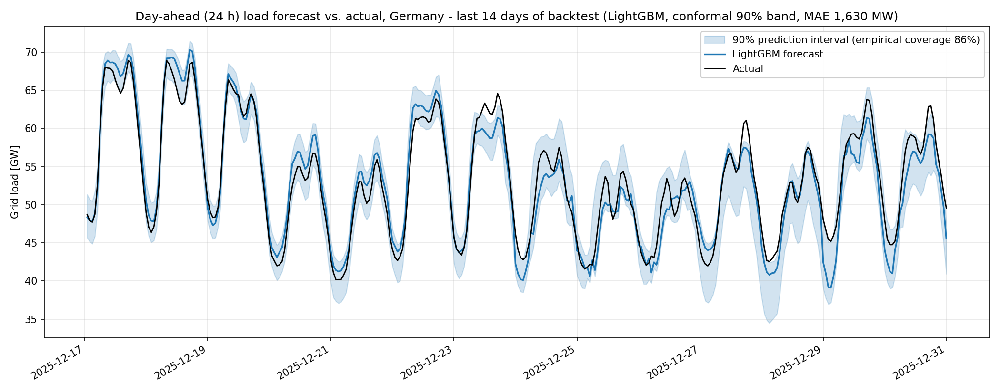

# Day-ahead electricity demand forecasting for Germany

Hourly grid-load forecasts for Germany (1–48 h ahead) with **LightGBM**, benchmarked against seasonal-naive,
SARIMA and Prophet baselines, evaluated with **rolling-origin backtesting** and equipped with **90 % prediction
intervals from quantile regression**.



> The figure above is produced by `python -m src.run_pipeline` (see *Quick start*). Paste the generated
> tables from `reports/results.md` into the **Results** section below after your run.

## Data

| Source | What | Notes |
|---|---|---|
| [SMARD.de](https://www.smard.de) (Bundesnetzagentur) | Total grid load ("Netzlast"), filter 410 | Current data. Loaded through the JSON endpoints behind the SMARD charts (UTC timestamps) or from a manual CSV export (local time). |
| [Open Power System Data](https://data.open-power-system-data.org/time_series/) | `DE_load_actual_entsoe_transparency` | UTC, but coverage ends in 2020. |
| [Open-Meteo](https://open-meteo.com) archive API | 2 m temperature, 7 population-weighted regions | Free, no key, non-commercial use. |

## Quick start

```bash
python -m venv .venv && source .venv/bin/activate
pip install -r requirements.txt

# A) fully automatic (SMARD JSON endpoints + Open-Meteo)
python -m src.run_pipeline --source smard_api --start 2019-01-01 --end 2025-12-31

# B) from a CSV you downloaded at smard.de/en/downloadcenter  (Grid load, hourly or 15-min)
python -m src.run_pipeline --source smard_csv --csv data/raw/smard_export.csv --start 2019-01-01 --end 2025-12-31

# C) Open Power System Data (2015 - 2020)
python -m src.run_pipeline --source opsd --start 2015-01-01 --end 2020-09-30

pytest -q            # DST round-trip, gap handling, no-look-ahead test
```

Useful flags: `--no-weather`, `--skip-sarima`, `--skip-prophet`, `--folds 4 --test-days 91`.
Everything tunable (horizons, folds, quantiles, cities) is in `src/config.py`.

Outputs: `reports/results.md`, `reports/metrics_by_horizon.csv`, `reports/backtest_predictions.csv`,
`reports/figures/*.png`, `models/lgbm_{point,lo,hi}.txt`.

## What the pipeline does

### 1. Load, audit, clean
* Everything is converted to a **strictly hourly UTC series**. Local time is reconstructed only to build
  calendar features.
* **Daylight-saving gotcha.** SMARD CSV exports use local wall-clock labels: on the last Sunday of October the
  `02:00` hour appears **twice**, on the last Sunday of March it **never** appears. `read_smard_csv` audits both
  artefacts (`dst_audit`), localises with an explicit first/second-occurrence flag, and converts to UTC. A unit test
  writes a SMARD-style CSV across both transitions and checks the round trip is exact (hourly *and* 15-minute files).
* Cleaning: duplicates merged, non-physical values (< 10 GW) removed, **only gaps ≤ 3 h are interpolated**; longer
  gaps stay NaN and those rows are dropped, not invented. A summary is written to `reports/data_quality.json`.
* Seasonality plot (`reports/figures/seasonality.png`): daily, weekly and yearly profiles + ACF, which shows the peaks at
  lags 24 h and 168 h that motivate the features below.

### 2. Baselines
| Model | Idea |
|---|---|
| Seasonal naive – week | load at the same hour last week (`T-168h`) |
| Seasonal naive – day | same hour on the latest available day (`T-24h`, or `T-48h` for horizons > 24 h) |
| SARIMA(1,0,1)(1,1,1)₂₄ | fitted once per fold on the last 8 weeks; parameters re-applied to a 14-day sliding window at every forecast origin (no per-origin refit) |
| Prophet | daily + weekly + yearly seasonality, German holidays, temperature regressor; fitted on local wall-clock time so DST does not shift the daily profile |

SARIMA with a 24 h period cannot represent the weekly cycle and Prophet ignores recent observations; both are
expected to lose clearly to the weekly naive baseline at short horizons. They are there to show what "classical" gets you.

### 3. Features (`src/features.py`)
The task is framed as **direct multi-horizon**: one row = (forecast origin *t*, horizon *h*) → load at *T = t + h*.
Forecasts are issued every 6 hours (00/06/12/18 UTC), so every horizon sees every time of day.

* **Residual target:** the model predicts `y − ref`, where `ref` is the median of the same hour over the previous 4 weeks.
  Trees then only learn *deviations* from the normal weekly pattern, and cannot be thrown off by slow level drift.
* **Short-term state at the origin:** deviation from that norm over the last 1 / 3 / 24 h (`dev_t`, `dev_mean3`, `dev_mean24`),
  1 h and 3 h changes. These carry the "what is happening right now" signal that matters most at short horizons.
* **Lags:** `lag_day` = load at `T − 24·⌈h/24⌉` (latest same-hour value that is already *known* at the origin),
  `lag_week` (`T−168`), `lag_2week` (`T−336`), median of the same hour over the previous 4 weeks.
* **Rolling statistics at the origin:** mean of the last 24 h / 168 h, std of the last 24 h, latest values, and
  `level_ratio` (this week vs. last week).
* **Calendar (local time):** hour, weekday, month, day of year, cyclic encodings, weekend, **German public holidays** from the
  [`holidays`](https://pypi.org/project/holidays/) package. Holidays are regional, so each day gets a **population-weighted
  share of states** that have a holiday (1.0 = nationwide), plus previous/next-day share, bridge days, and Christmas–New Year.
* **Temperature:** population-weighted, at the target hour, plus 24 h / 72 h rolling means, 24 h change, heating/cooling degrees.
* `horizon` itself is a feature, so one model serves all horizons.

### 4. LightGBM, time-based validation only
* **Rolling-origin (expanding-window) backtest**: 4 folds × 91 days, the last fold ending at the most recent data, so every
  season is tested at least once with a model that only saw the past. No random splits anywhere.
* Inside each fold the data before the test period is split in time into *fit → early-stopping (45 d) → calibration (45 d)*.
  Rows whose **target time** reaches into the next slice are removed (no label look-ahead).
* `tests/test_pipeline_pieces.py::test_no_look_ahead_in_load_features` perturbs all load values after an origin and asserts that
  no feature changes.
* A final model is refitted on all data (tree count = mean best iteration of the folds × 1.1) and saved to `models/`.

### 5. Evaluation
* **MAE, RMSE, MAPE for each horizon 1…48 h**, all models scored on the *same* rows (`reports/metrics_by_horizon.csv`,
  `reports/figures/mae_by_horizon.png`).
* **Prediction intervals:** two extra LightGBM models with the quantile objective (α = 0.05 and 0.95) → raw 90 % interval,
  then **conformalised quantile regression**: on the calibration slice we measure how far actuals fall outside the raw band
  and widen it by that amount, separately for horizon groups 1–6, 7–12, 13–24, 25–36, 37–48 h. Both raw and conformal
  empirical coverage/width are reported per horizon. Quantile crossing is repaired (`lo ≤ point ≤ hi`).
* Error is also broken down by **horizon block** and by **day type** (normal weekday / weekend / holiday-bridge-Christmas).

## Results

_Run the pipeline, then paste `reports/results.md` here._

| Model | MAE [MW] | RMSE [MW] | MAPE [%] |
|---|---|---|---|
| Seasonal naive (week) | | | |
| SARIMA | | | |
| Prophet | | | |
| **LightGBM** | | | |

Things worth checking and writing up once you have real numbers: MAE vs. horizon (flat or growing?), error on
holidays/bridge days vs. normal days, coverage vs. the nominal 90 % (quantile GBMs are often slightly over-confident),
and the 2020–2021 COVID period if your range includes it.

## Limitations and honest caveats

* **Perfect-forecast temperature.** The archive API gives *observed* weather, so the model sees the true temperature for the
  target hour. In production you would feed a numerical weather forecast (typical error 1–2 K), and accuracy would be somewhat
  lower. For a more honest evaluation, use Open-Meteo's historical-forecast API (archived NWP forecasts; check their docs for
  the current endpoint and date coverage).
* **Structural breaks.** Rooftop PV and heat pumps change the load shape over the years, and 2020–21 was COVID-affected.
  Consider restricting `--start`, or adding a trend/year feature and testing a shorter training window.
* **Interval calibration.** Conformal calibration assumes the calibration slice resembles the test period. Seasonal changes
  (e.g. calibrating on autumn, testing in winter) can still leave coverage a few points off 90 %; check `interval_by_horizon.csv`.
* SARIMA is evaluated with a cheap parameter re-use scheme and Prophet cannot use recent observations; neither is tuned.
* The temperature weights are rough regional populations, not an exact load-weighted average.

## Project layout

```
src/
  config.py         horizons, folds, quantiles, cities
  data.py           SMARD API / SMARD CSV / OPSD loaders, DST audit, cleaning
  weather.py        Open-Meteo temperature (population weighted)
  eda.py            seasonality + ACF plots
  features.py       lags, rolling stats, calendar, holidays, temperature
  baselines.py      SARIMA, Prophet
  model.py          LightGBM point + quantile models
  evaluate.py       MAE/RMSE/MAPE per horizon, interval diagnostics, plots
  run_pipeline.py   end-to-end CLI
  synthetic.py      fake data for tests / offline dry-runs (never report results from it)
tests/              DST round trip, gap handling, no-look-ahead
```

## Possible extensions
* Ablation: with vs. without temperature; with vs. without holidays.
* Add wind/solar generation or day-ahead price as features, or forecast the residual load.
* Quantile forecasts for more levels (10/50/90) and a CRPS comparison.
* See [`docs/WHAT_WAS_WRONG_AND_HOW_TO_IMPROVE.md`](docs/WHAT_WAS_WRONG_AND_HOW_TO_IMPROVE.md) for a prioritised list.
* SHAP analysis of holiday and temperature effects.
